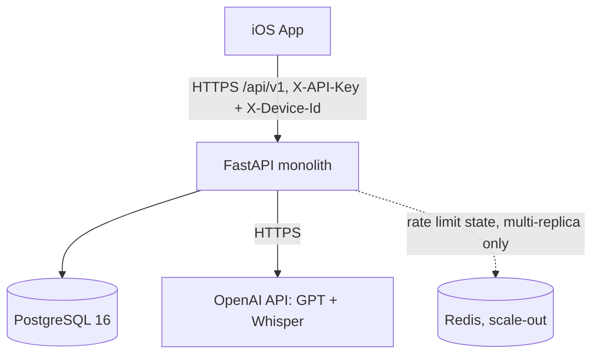
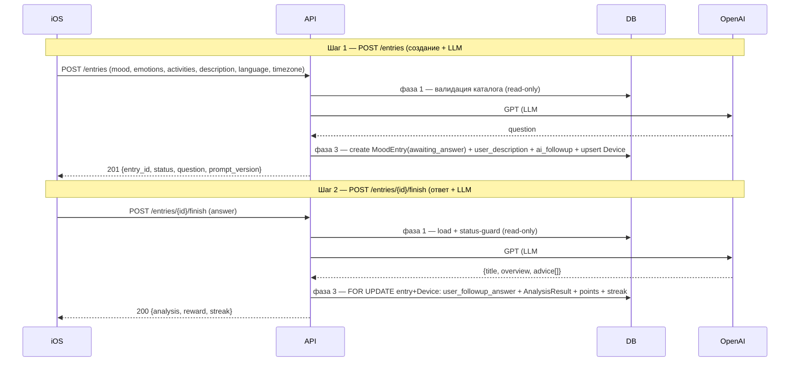
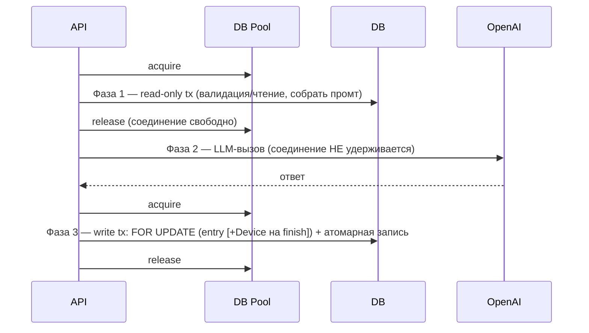

# 01 — Architecture

## Топология

Монолит (ADR-002): один FastAPI-сервис, обслуживающий REST API `/api/v1` для iOS-клиента. Внешние зависимости — PostgreSQL (prod) и OpenAI API (GPT + Whisper). Rate limiting: in-memory при single-instance деплое (текущий prod за Traefik), Redis обязателен только при масштабировании на >1 реплику (Q-RATE-1).



## Компоненты (внутренняя структура)

```
app/
  main.py                  — сборка приложения, middleware, роутер
  core/
    config.py              — pydantic-settings (env)
    logging.py             — структурное логирование без секретов/текста сообщений
    rate_limit.py          — лимитер (Redis/in-memory)
    errors.py              — единый формат ошибок {error:{code,message,details?}}
  db/
    base.py, session.py    — async engine/session
    models/                — device, catalog, entry, analysis, gamification
  schemas/                 — Pydantic v2 request/response
  api/
    deps.py                — DI: device-id, db session, rate limit
    v1/router.py
    v1/routes/             — me, moods, activities, transcriptions, entries
  services/                — catalog, entry, streak, points, analysis
  llm/
    openai_client.py
    transcription.py       — Whisper
    analysis_schema.py     — Structured Outputs json_schema
    language.py            — выбор/детект языка
    prompts/{registry.py, v1.py}  — дословные промты + PROMPT_VERSION
  seed/catalog_seed.py     — seed эмоций/activity
alembic/                   — миграции
tests/
```

## Поток данных: жизненный цикл записи

2-POST lifecycle (ADR-003): два шага записи по числу ответов ИИ. Голос (опц.) транскрибируется отдельным stateless вызовом до каждого шага.



## Ключевые архитектурные принципы

- **Entry как двухшаговый ресурс** (ADR-003): 2 POST по числу ответов ИИ (`POST /entries` → `awaiting_answer` → `POST /finish` → `finished`). Нарушение перехода → `409`.
- **Транскрипция stateless** (ADR-004): отдельный `POST /transcriptions`, не привязан к entry.
- **Structured Outputs** (ADR-005): анализ генерируется через OpenAI json_schema strict, валидация лимитов длины + 1 retry.
- **Язык от клиента** (ADR-006).
- **App-level аутентификация** (ADR-009): заголовок `X-API-Key` (статический секрет приложения) обязателен на `/api/v1/*`, проверяется middleware **первым** (constant-time), отсутствует/неверный → `401`. Не заменяет device-id.
- **Анонимность по device-id** (ADR-007): middleware (после app-key) upsert `Device`, скоуп всех данных по `device-id`. Чужой entry → `404` (не `403`, чтобы не раскрывать существование).
- **Трёхфазное управление соединением при синхронных LLM-вызовах** (ADR-008): `POST /entries` (LLM#1) и `POST /finish` (LLM#2) не удерживают DB-соединение во время вызова OpenAI.

## Управление DB-соединением при LLM-вызовах (ADR-008)

`POST /entries` (LLM#1) и `POST /entries/{id}/finish` (LLM#2) делают синхронный вызов OpenAI. Чтобы не держать соединение из пула на время сетевого вызова (~`OPENAI_TIMEOUT_SECONDS`), оба эндпоинта построены по трёхфазному паттерну:



- Во время фазы 2 `pool.checkedout()` не растёт за счёт этого запроса → размер пула определяется короткими tx, а не длительностью LLM.
- `POST /entries` (фаза 3): создаёт `MoodEntry(awaiting_answer)` + сообщения + upsert `Device` — только при успехе LLM#1 (иначе запись не создаётся).
- `POST /finish` (фаза 3): берёт `SELECT ... FOR UPDATE OF mood_entries` (повторный status-guard, сериализация конкурентного finish) **и** `FOR UPDATE` строки `Device` (сериализация points+streak, фикс lost-update). Реальная блокировка на PostgreSQL, no-op на SQLite.
- Pool sizing/timeout — [07-deployment.md](07-deployment.md), обоснование и альтернативы — [ADR-008](adr/ADR-008-llm-connection-management.md).

## Deployment topology

Контейнеризованный сервис + управляемый PostgreSQL. Детали — [07-deployment.md](07-deployment.md).
