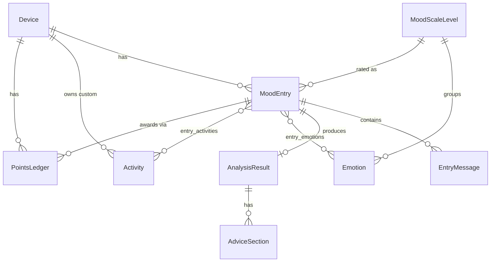

# 03 — Data Model

SQLAlchemy 2.x (async). PK — UUID. Времена — `timestamptz` UTC (в SQLite — naive UTC). JSONB в Postgres → JSON в SQLite.

## ER-диаграмма

## Таблицы

### Device
Анонимное устройство = пользователь.
| Поле | Тип | Примечание |
|---|---|---|
| id | UUID (PK) | = `device-id` (UUID v4, приходит в заголовке) |
| locale | text null | последний известный язык/локаль (BCP-47). В API отдаётся как поле `language` (`GET /me`): имя БД-поля — `locale`, клиентское имя — `language` |
| timezone | text null | IANA tz (для streak по локальной дате, Q-GAME-2). Upsert'ится из поля `timezone` в `POST /entries` (last-write-wins). `null`/невалидная → streak по UTC |
| points_balance | int, default 0 | денормализованная сумма `PointsLedger.delta` |
| current_streak | int, default 0 | |
| longest_streak | int, default 0 | |
| last_entry_date | date null | локальная дата последнего finished entry |
| created_at | timestamptz | |
| last_seen_at | timestamptz | обновляется middleware при каждом запросе |

### MoodScaleLevel
Шкала настроения 1..5.
| Поле | Тип | Примечание |
|---|---|---|
| id | UUID (PK) | |
| value | int unique | 1..5 (1=terrible … 5=great) |
| code | text unique | напр. `terrible`,`bad`,`okay`,`good`,`great` |
| label | text | человекочитаемая метка |
| order | int | порядок отображения |

### Emotion
| Поле | Тип | Примечание |
|---|---|---|
| id | UUID (PK) | |
| code | text unique | стабильный идентификатор |
| label | text | метка (UI) |
| scale_level_id | UUID FK → MoodScaleLevel | к какому уровню относится |
| order | int | |
| is_active | bool, default true | |

### Activity
| Поле | Тип | Примечание |
|---|---|---|
| id | UUID (PK) | |
| label | text | |
| code | text null | для built-in (глобальных) |
| device_id | UUID FK → Device, null | NULL = глобальная built-in; иначе кастомная |
| is_custom | bool | |
| created_at | timestamptz | |

Уникальность: `(device_id, lower(label))` — дедуп кастомных активностей на устройстве. Для глобальных (`device_id IS NULL`) — отдельный уникальный индекс по `lower(label)` где `device_id IS NULL`.

### MoodEntry
| Поле | Тип | Примечание |
|---|---|---|
| id | UUID (PK) | |
| device_id | UUID FK → Device | скоуп |
| status | enum | см. [04-api-contract.md](04-api-contract.md) state machine |
| mood_scale_level_id | UUID FK, NOT NULL | задаётся при создании (`mood` обязателен в `POST /entries`) |
| language | text null | BCP-47, для LLM (ADR-006) |
| points_awarded | int null | заполняется на finish |
| created_at | timestamptz | |
| finished_at | timestamptz null | |

Индексы: `(device_id, status)`, `(device_id, finished_at DESC)` — история.

Enum статусов (2-шаговый lifecycle, ADR-003): `awaiting_answer`, `finished`. Запись создаётся сразу в `awaiting_answer` (после успешного LLM#1); `POST /finish` переводит в `finished`.

### entry_emotions / entry_activities
m2m: `(entry_id, emotion_id)` / `(entry_id, activity_id)`.

### EntryMessage
| Поле | Тип | Примечание |
|---|---|---|
| id | UUID (PK) | |
| entry_id | UUID FK → MoodEntry | |
| role | enum | `user_description`, `ai_followup`, `user_followup_answer` |
| content | text | |
| source | enum null | `text`, `voice` (для user-сообщений) |
| prompt_version | text null | для `ai_followup` — версия промта |
| created_at | timestamptz | |

### AnalysisResult (1:1 с finished entry)
| Поле | Тип | Примечание |
|---|---|---|
| id | UUID (PK) | |
| entry_id | UUID FK unique → MoodEntry | |
| title | text | ≤ 3 слова |
| overview | text | ≤ 40 слов |
| language | text | язык ответа |
| model | text | id GPT-модели |
| prompt_version | text | |
| raw_response | JSONB | сырой ответ LLM |
| created_at | timestamptz | |

### AdviceSection
| Поле | Тип | Примечание |
|---|---|---|
| id | UUID (PK) | |
| analysis_id | UUID FK → AnalysisResult | |
| position | int | порядок |
| heading | text | |
| body | text | |

### PointsLedger (append-only)
| Поле | Тип | Примечание |
|---|---|---|
| id | UUID (PK) | |
| device_id | UUID FK → Device | |
| delta | int | напр. +20 |
| reason | enum | `entry_finished` (расширяемо) |
| entry_id | UUID FK null → MoodEntry | |
| created_at | timestamptz | |

`Device.points_balance` обновляется в той же транзакции, что и вставка в ledger. Начисление за entry идемпотентно: ledger-запись с `(entry_id, reason)` создаётся один раз (см. Q-GAME-1, константа `POINTS_PER_ENTRY=20`).

## Заметки о консистентности

- `POST /entries` — атомарная транзакция (фаза 3, ADR-008): создание `MoodEntry(awaiting_answer)`, `entry_emotions`/`entry_activities`, `EntryMessage(user_description)` + `EntryMessage(ai_followup)`, upsert `Device.timezone`/`locale`. Выполняется только при успешном LLM#1 — иначе запись не создаётся.
- Finish — атомарная транзакция (фаза 3, ADR-008): `EntryMessage(user_followup_answer)`, статус→`finished`, `AnalysisResult`+`AdviceSection`, `PointsLedger`+`points_balance`, пересчёт streak, `finished_at`. Под `SELECT ... FOR UPDATE` на строке `MoodEntry` (повторный status-guard) **и** на строке `Device` (сериализация `points_balance` + streak). Повторный finish finished-записи → `409`.
- Streak: `current_streak`/`longest_streak`/`last_entry_date` на `Device`, считается по локальной дате с учётом `timezone` (Q-GAME-2). `timezone` задаётся клиентом через `POST /entries`; при отсутствии — fallback на UTC. Блокировка строки `Device` в транзакции finish защищает read-modify-write streak/points от lost-update при одновременном finish двух разных записей одного устройства (ADR-008).
