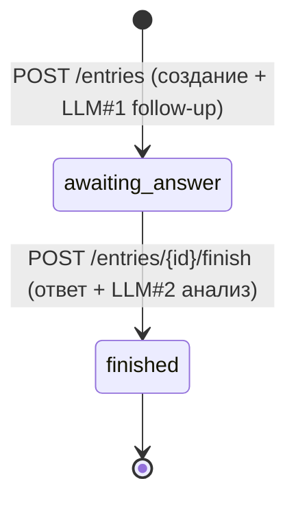

# API-контракт «Mood Tracker» для iOS

Документ предназначен для прямой передачи iOS-разработчику. Описывает все endpoint'ы, заголовки, форматы запросов/ответов, ошибки, state machine и happy-path. Версия контракта: **v1**.

> **Lifecycle v1 — два POST.** Запись настроения проходит ровно два шага записи, по числу ответов ИИ: `POST /entries` (создание записи + первый эмпатичный follow-up от ИИ) и `POST /entries/{id}/finish` (ответ пользователя + финальный анализ). Промежуточных серверных шагов выбора настроения/активностей нет — клиент собирает их в UI и отправляет всё одним телом в `POST /entries`. См. [ADR-003](adr/ADR-003-entry-state-machine.md).

---

## 1. Базовый URL и версионирование

```
https://<host>/api/v1
```

- Все ресурсы (кроме `/health`) живут под префиксом `/api/v1`.
- `/health` доступен без версии и без заголовков: `GET https://<host>/health`.
- Версионирование — через путь (`/api/v1`). Несовместимые изменения → `/api/v2`.

---

## 2. Общие заголовки

| Заголовок | Обязателен | Значение |
|---|---|---|
| `X-API-Key` | Да (везде, кроме `/health`) | Статический общий секрет приложения. Аутентифицирует **приложение** (один ключ на все инсталляции). Прошивается в iOS-клиент. |
| `X-Device-Id` | Да (везде, кроме `/health`) | UUID v4, постоянный идентификатор устройства. Генерируется на iOS один раз и хранится в Keychain. |
| `Content-Type` | Для запросов с телом | `application/json; charset=utf-8`. Для `POST /transcriptions` — `multipart/form-data`. |
| `Accept-Language` | Желательно | BCP-47, напр. `en-US`, `ru-RU`. Используется как fallback для языка LLM, если в теле не передан `language`. |

> `X-API-Key` обязателен в **каждом** вызове `/api/v1/*` (примеры запросов ниже его не повторяют ради краткости — подразумевается всегда). Единственное исключение — `GET /health`: без `X-API-Key` и без `X-Device-Id`.

### Про аутентификацию: `X-API-Key` (приложение) vs `X-Device-Id` (устройство)

- **Два независимых заголовка, оба обязательны вместе** на `/api/v1/*` (ADR-009 + ADR-007):
  - `X-API-Key` аутентифицирует **приложение** — статический общий секрет, отсекает доступ извне легитимного клиента.
  - `X-Device-Id` идентифицирует **устройство/пользователя** анонимно (логина/аккаунтов нет).
  - Одно **не заменяет** другое.
- **Порядок проверки на сервере: сначала `X-API-Key`, затем `X-Device-Id`.** Запрос без/с неверным ключом отклоняется (`401`) до проверки device-id и до создания `Device`.
- Ошибки ключа: отсутствует → `401 api_key_required`; неверный → `401 api_key_invalid` (без раскрытия деталей). См. §3.

### Про `X-Device-Id`

- Должен быть валидным UUID v4. Невалидный/отсутствующий (кроме `/health`) → `400` с кодом `device_id_required` / `device_id_invalid`.
- При первом запросе backend автоматически создаёт `Device` (upsert). Регистрация не требуется.
- Переустановка приложения = новый `device-id` = новый «пользователь», прежние данные недоступны (см. open question Q-ID-1). Для сохранения данных между переустановками клиент обязан хранить id в Keychain (переживает удаление приложения).
- Все данные строго скоупятся по `device-id`. Доступ к чужому ресурсу возвращает `404` (не `403`), чтобы не раскрывать его существование.

### Про язык (`language` / `Accept-Language`)

- Приоритет выбора языка ответа LLM: поле `language` в теле `POST /entries` → `Accept-Language` → серверный автодетект по тексту описания (см. §6.3).
- Выбранный язык фиксируется в entry в момент `POST /entries` и используется в обоих LLM-вызовах этой записи (follow-up и анализ). **LLM отвечает на этом языке** (title/overview/advice/follow-up).

### Про часовой пояс (`timezone`)

- `timezone` — строка **IANA** (напр. `Europe/Amsterdam`, `Asia/Tokyo`). Используется для расчёта streak по **локальной** дате завершения записи (Q-GAME-2) и отдаётся в `GET /me`.
- Хранится на устройстве (`Device.timezone`). Клиент задаёт его **опциональным полем `timezone`** в теле `POST /entries` (по аналогии с `language`). Если поле передано и валидно, значение **upsert'ится** в `Device.timezone` (last-write-wins).
- **Дефолт при отсутствии:** если `Device.timezone` ещё не установлен (`null`) или содержит невалидную зону, streak считается по **UTC**. Невалидная зона в запросе игнорируется (логируется), `Device.timezone` не перезаписывается мусором; ошибка валидации не возвращается.
- Рекомендация iOS: передавать `TimeZone.current.identifier` в `timezone` при `POST /entries`, чтобы streak считался по местному времени пользователя.

---

## 3. Формат ошибок

Все ошибки имеют единое тело:

```json
{
  "error": {
    "code": "entry_invalid_transition",
    "message": "Finish is only allowed while the entry is awaiting an answer.",
    "details": { "current_status": "finished", "required_status": "awaiting_answer" }
  }
}
```

- `code` — стабильная машиночитаемая строка (используйте её, не текст).
- `message` — человекочитаемое описание (англ., для логов/отладки; не показывать пользователю как есть).
- `details` — опционально, контекст.

Пример ответа при отсутствии ключа приложения (`401`, без `details` — детали не раскрываются):
```json
{ "error": { "code": "api_key_required", "message": "Application API key is required." } }
```

### Таблица HTTP-статусов и кодов

| HTTP | Когда возникает | Примеры `code` |
|---|---|---|
| `401` | App-level аутентификация не пройдена: нет/неверный `X-API-Key`. Проверяется **до** `X-Device-Id`. Деталей не раскрывает | `api_key_required`, `api_key_invalid` |
| `400` | Некорректный запрос: нет/битый `X-Device-Id`, нечитаемый JSON, отсутствует обязательное поле | `device_id_required`, `device_id_invalid`, `bad_request` |
| `404` | Ресурс не найден или принадлежит другому устройству (entry, activity) | `entry_not_found`, `activity_not_found` |
| `409` | Конфликт состояния: finish записи не в статусе `awaiting_answer`; повторный finish; дубликат кастомной активности | `entry_invalid_transition`, `entry_already_finished`, `activity_duplicate` |
| `413` | Тело/файл превышает лимит (аудио > 10 MB) | `payload_too_large` |
| `415` | Неподдерживаемый MIME (аудио не из allow-list; неверный `Content-Type`) | `unsupported_media_type` |
| `422` | Валидация полей не прошла: формат, длина текста (> ~4000 симв.), пустое описание/ответ, неизвестный enum/код эмоции/уровня, эмоция не соответствует уровню mood | `validation_error` |
| `429` | Превышен rate limit. Возвращается заголовок `Retry-After` (секунды) | `rate_limited` |
| `502` | Ошибка вышестоящего LLM-провайдера (OpenAI вернул ошибку/невалидный ответ после retry) | `llm_upstream_error` |
| `503` | LLM/сервис временно недоступен, таймаут (~30с), деградация | `llm_unavailable`, `service_unavailable` |

> Клиенту рекомендуется: на `429` — повтор после `Retry-After`; на `502/503` при LLM-шагах — показать «попробуйте ещё раз». Оба POST-шага идемпотентны при ошибке LLM: при `502/503` запись **не создаётся** (`POST /entries`) или **не финализируется** (`POST /finish`) — можно безопасно повторить тот же запрос с тем же телом.

---

## 4. Enum-значения

| Enum | Значения |
|---|---|
| **Статус entry** | `awaiting_answer`, `finished` |
| **role сообщения** | `user_description`, `ai_followup`, `user_followup_answer` |
| **source** | `text`, `voice` |
| **reason очков** | `entry_finished` |
| **mood scale value** | `1` (terrible), `2` (bad), `3` (okay), `4` (good), `5` (great) |

---

## 5. State machine записи (entry)



Правила (единое поведение):

- **`POST /entries` создаёт запись сразу в статусе `awaiting_answer`.** В теле передаются все данные шага сбора (`mood`, `emotions`, `activities`, `description`); сервер их сохраняет, синхронно вызывает LLM#1 и возвращает follow-up вопрос. Запись существует, только если LLM#1 успешен (см. §6.4 и [ADR-008](adr/ADR-008-llm-connection-management.md)).
- **`POST /entries/{id}/finish`** допустим только из статуса `awaiting_answer`: сохраняет ответ пользователя, вызывает LLM#2 (анализ), начисляет очки и streak, переводит в `finished`.
- `POST /finish` из статуса, отличного от `awaiting_answer` → `409 entry_invalid_transition` с `details.current_status`.
- `POST /finish` на уже `finished` записи → `409 entry_already_finished` (идемпотентная защита от повторной финализации/двойного начисления).
- При ошибке LLM (`502/503`) статус **не меняется** (а на `POST /entries` запись и вовсе не создаётся) — клиент повторяет тот же шаг с тем же телом.

> Follow-up обязателен перед finish и ровно один — теперь это **структурно гарантировано** дизайном из двух POST: `POST /entries` всегда порождает один follow-up, `POST /finish` всегда отвечает на него ([Q-ENTRY-1](99-open-questions.md#q-entry-1), [Q-ENTRY-2](99-open-questions.md#q-entry-2)). Незавершённые записи (созданы, но не финализированы) в MVP не удаляются и не перечисляются клиентом — см. [Q-ENTRY-3](99-open-questions.md#q-entry-3).

---

## 6. Endpoints

Все ниже — под `/api/v1`, с заголовками `X-API-Key` и `X-Device-Id`, если не указано иное.

> **Почему GET, а не POST для чтения.** Эндпоинты `GET /moods`, `GET /activities`, `GET /entries`, `GET /entries/{id}`, `GET /entries/{id}/analysis`, `GET /me*`, `GET /health` — это **чтение без side-effects**: они идемпотентны, не меняют состояние и кэшируемы, поэтому по REST остаются `GET`. `POST` используется только для операций с побочными эффектами: создание записи + синхронный LLM-вызов (`POST /entries`, `POST /finish`), создание кастомной активности (`POST /activities`), распознавание речи (`POST /transcriptions`), а `DELETE /me` — для удаления. Два шага записи именно `POST`, потому что каждый меняет состояние и запускает LLM-вызов.

### 6.1 Профиль

#### `GET /me`
Профиль устройства (создаётся при первом обращении).

Ответ `200`:
```json
{
  "device_id": "f47ac10b-58cc-4372-a567-0e02b2c3d479",
  "points_balance": 60,
  "current_streak": 3,
  "longest_streak": 7,
  "last_entry_date": "2026-06-25",
  "language": "en-US",
  "timezone": "Europe/Amsterdam",
  "created_at": "2026-06-01T08:12:00Z"
}
```
- `language` — последний известный язык устройства в формате BCP-47. Хранится в `Device.locale` (поле БД называется `locale`, в API отдаётся как `language`); обновляется при создании записи с явным `language`. `null`, если ещё неизвестен.
- `timezone` — IANA tz; `null`, если ещё не задан (клиент устанавливает его полем `timezone` в `POST /entries`). При `null` streak считается по UTC.

Ошибки: `400`.

#### `GET /me/streak`
Ответ `200`:
```json
{ "current_streak": 3, "longest_streak": 7, "last_entry_date": "2026-06-25" }
```

#### `GET /me/points`
Ответ `200`:
```json
{ "points_balance": 60, "points_per_entry": 20 }
```

#### `DELETE /me`
Удаляет устройство и все связанные данные (entries, сообщения, анализы, кастомные активности, ledger). Необратимо. (Добавлено по Q-DATA-1.)

Ответ `204` (без тела). Ошибки: `400`.

---

### 6.2 Каталог

#### `GET /moods`
Список уровней настроения с эмоциями.

Query: `language` (опц.) — для локализованных меток (если поддержано seed-данными).

Ответ `200`:
```json
{
  "levels": [
    {
      "value": 1, "code": "terrible", "label": "Terrible", "order": 1,
      "emotions": [
        { "code": "anxious", "label": "Anxious", "order": 1 },
        { "code": "angry", "label": "Angry", "order": 2 }
      ]
    },
    {
      "value": 5, "code": "great", "label": "Great", "order": 5,
      "emotions": [
        { "code": "joyful", "label": "Joyful", "order": 1 },
        { "code": "grateful", "label": "Grateful", "order": 2 }
      ]
    }
  ]
}
```
> built-in seed-каталог эмоций/уровней = baseline-дефолт (Q-CATALOG-1 resolved-by-design); placeholder-набор приемлем, точные значения из Figma могут быть уточнены позже без изменения формата. Значения выше — пример формата.

#### `GET /activities`
built-in (глобальные) + кастомные активности этого устройства.

Ответ `200`:
```json
{
  "activities": [
    { "id": "9b1f...", "code": "work", "label": "Work", "is_custom": false },
    { "id": "a2c4...", "code": "sport", "label": "Sport", "is_custom": false },
    { "id": "c7e9...", "code": null, "label": "Pottery class", "is_custom": true }
  ]
}
```

#### `POST /activities`
Создать кастомную активность (дедуп по `lower(label)` в пределах устройства).

Тело:
```json
{ "label": "Pottery class" }
```
Ответ `201`:
```json
{ "id": "c7e9...", "code": null, "label": "Pottery class", "is_custom": true }
```
Ошибки: `409 activity_duplicate` (уже есть такая по label), `422 validation_error` (пустой/слишком длинный label), `400`.

---

### 6.3 Транскрипция (STT)

#### `POST /transcriptions`
Stateless распознавание речи. Не привязан к entry. Строгий rate limit.

- `Content-Type: multipart/form-data`
- Поле формы: **`audio`** (файл).
- Допустимые MIME (allow-list, проверяются по заголовку **и** по magic-bytes сигнатуре): `audio/mp4`, `audio/m4a`, `audio/x-m4a`, `audio/aac`, `audio/mpeg` (mp3), `audio/wav`, `audio/x-caf`. `audio/x-m4a` и `audio/mp4` включены, т.к. iOS AVFoundation выставляет именно их для `.m4a`-записей — фактический формат iOS-клиента. Решение по MIME принимается по совпадению заголовка ИЛИ сигнатуры в allow-list, чтобы избежать ложных `415`.
- Максимальный размер файла: **10 MB**.

Пример (псевдо-multipart):
```
POST /api/v1/transcriptions
Content-Type: multipart/form-data; boundary=...
--...
Content-Disposition: form-data; name="audio"; filename="rec.m4a"
Content-Type: audio/m4a

<binary>
--...--
```

Ответ `200`:
```json
{ "text": "I had a really rough day at work and felt overwhelmed.", "detected_language": "en" }
```
- `detected_language` — код языка в формате **ISO 639-1** (2 буквы, напр. `en`, `ru`), как его возвращает Whisper. Это НЕ BCP-47. Может быть `null`, если язык не определён.
- **Как использовать (важно):** `/transcriptions` **stateless** — backend **не** запоминает `detected_language` и **не** связывает его с будущей записью. Чтобы голос-детектированный язык применился к записи, клиент должен **сам передать `detected_language` как поле `language` в `POST /entries`** (ISO 639-1 трактуется как BCP-47 без региона: `ru` → `ru`). Тогда он попадёт в `MoodEntry.language` с высшим приоритетом.
- **Серверный fallback (если `language` и `Accept-Language` отсутствуют):** на LLM-шаге backend автодетектит язык **по тексту описания** грубой скрипт-эвристикой Unicode (Cyrillic → `ru`, CJK → `zh`, Кана → `ja`, Hangul → `ko`, Arabic → `ar`, иначе → `en`). Это резерв; для точного языка передавайте `language` (см. ADR-006).

Ошибки: `413 payload_too_large` (> 10 MB), `415 unsupported_media_type` (MIME не из allow-list / не совпала сигнатура), `429 rate_limited`, `502/503` (Whisper недоступен), `400`.

> Транскрипция выполняется **до** шагов записи: полученный `text` клиент подставляет как `description` в `POST /entries` (с `source: "voice"`) или как `answer` в `POST /entries/{id}/finish`. Аудио на сервере **не сохраняется**.

---

### 6.4 Жизненный цикл записи (entry)

#### `POST /entries`
Создать запись и получить первый эмпатичный follow-up вопрос. **Один синхронный LLM-вызов (LLM#1).** Строгий rate limit (таймаут ~30с + 1 retry).

Тело:
```json
{
  "mood": 2,
  "emotions": ["anxious", "tired"],
  "activities": ["9b1f...", "c7e9..."],
  "description": "I had a really rough day at work and felt overwhelmed.",
  "source": "voice",
  "language": "en-US",
  "timezone": "Europe/Amsterdam"
}
```

| Поле | Required | Тип | Дефолт | Примечание |
|---|---|---|---|---|
| `mood` | **required** | int 1..5 | — | значение `MoodScaleLevel` |
| `emotions` | **required** | string[] | — | массив `code` эмоций; **может быть пустым** `[]`; каждая эмоция должна принадлежать уровню `mood` |
| `activities` | optional | string[] | `[]` | массив `id` активностей (built-in или кастомных этого устройства) |
| `description` | **required** | string, непустой, ≤ ~4000 симв. | — | рассказ пользователя (текст или транскрипт голоса) |
| `source` | optional | `text` \| `voice` | `text` | источник `description` |
| `language` | optional | string (BCP-47) | `Accept-Language` → автодетект | язык ответа LLM |
| `timezone` | optional | string (IANA) | сохранённый `Device.timezone` → UTC | upsert в `Device.timezone`; для streak по локальной дате (Q-GAME-2). Невалидная зона игнорируется |

**Правило соответствия эмоций уровню настроения:** каждая эмоция в `emotions` должна принадлежать выбранному уровню `mood` (`Emotion.scale_level_id` == уровень `mood`). Если хотя бы одна эмоция не относится к этому уровню → `422 validation_error` (`details` содержит несоответствующие коды). Пустой `emotions: []` валиден (проверять нечего).

**Поведение сервера (трёхфазно, [ADR-008](adr/ADR-008-llm-connection-management.md)):** валидация `mood`/`emotions`/`activities` по каталогу и сбор промта → синхронный LLM#1 (DB-соединение не удерживается) → в одной транзакции: создаётся `MoodEntry(status=awaiting_answer)`, сохраняются `mood`/`emotions`/`activities`, `EntryMessage(user_description)` и `EntryMessage(ai_followup, prompt_version)`, upsert `Device.timezone`/`locale`. **Если LLM#1 завершился ошибкой (`502/503`) — запись не создаётся**, клиент повторяет `POST /entries`.

Ответ `201`:
```json
{
  "entry_id": "8f14e45f-ceea-467a-9575-0e02b2c3d111",
  "status": "awaiting_answer",
  "question": "That sounds exhausting — what part of work felt heaviest for you today?",
  "prompt_version": "v1"
}
```
- `question` — текст follow-up от ИИ на языке записи. `prompt_version` — версия промта LLM#1.
- Полное состояние записи доступно через `GET /entries/{id}`.

Ошибки: `422 validation_error` (отсутствует/неизвестный `mood`/`emotion code`/`activity id`; эмоция не соответствует уровню `mood`; пустой/слишком длинный `description`), `429 rate_limited`, `502/503` (LLM#1), `400`.

#### `GET /entries/{id}`
Полное состояние записи.

Ответ `200`:
```json
{
  "id": "8f14e45f-ceea-467a-9575-0e02b2c3d111",
  "status": "awaiting_answer",
  "mood": 2,
  "emotions": ["anxious", "tired"],
  "activities": [{ "id": "9b1f...", "label": "Work" }],
  "language": "en-US",
  "messages": [
    { "role": "user_description", "content": "Rough day at work.", "source": "voice", "prompt_version": null, "created_at": "2026-06-26T10:00:00Z" },
    { "role": "ai_followup", "content": "That sounds exhausting — what part of work felt heaviest today?", "source": null, "prompt_version": "v1", "created_at": "2026-06-26T10:00:01Z" }
  ],
  "analysis": null,
  "created_at": "2026-06-26T10:00:00Z",
  "finished_at": null
}
```
- После `POST /finish` добавляется сообщение `user_followup_answer`, `status: "finished"`, заполняются `analysis` и `finished_at`.
- Поля сообщения: `source` — `text`|`voice` для пользовательских ролей, `null` для `ai_followup`. `prompt_version` — версия промта для `ai_followup`, `null` для пользовательских сообщений.

Ошибки: `404 entry_not_found` (нет или чужой), `400`.

#### `POST /entries/{id}/finish`
Ответить на follow-up, сгенерировать анализ (LLM#2), начислить очки и обновить streak. Переход `awaiting_answer → finished`. Атомарно, идемпотентно. **Один синхронный LLM-вызов (LLM#2).** Строгий rate limit (таймаут ~30с + 1 retry).

Тело:
| Поле | Required | Тип | Дефолт |
|---|---|---|---|
| `answer` | **required** | string, непустой, ≤ ~4000 симв. | — |
| `source` | optional | `text` \| `voice` | `text` |
```json
{ "answer": "Too many meetings, no time to focus.", "source": "text" }
```

**Поведение сервера (трёхфазно, [ADR-008](adr/ADR-008-llm-connection-management.md)):** read-only загрузка записи + status-guard (`awaiting_answer`) + сбор промта из `description` и `answer` → синхронный LLM#2 (DB-соединение не удерживается) → в одной транзакции под блокировкой строки записи (`SELECT ... FOR UPDATE`) и строки `Device` (сериализация очков+streak): сохраняется `EntryMessage(user_followup_answer)`, `AnalysisResult`+`AdviceSection`, начисляется `POINTS_PER_ENTRY` (ledger + `points_balance`), обновляется streak, `status→finished`, `finished_at`. **Если LLM#2 завершился ошибкой (`502/503`) — ничего не сохраняется**, статус остаётся `awaiting_answer`, клиент повторяет `POST /finish` с тем же `answer`.

Ответ `200`:
```json
{
  "analysis": {
    "title": "Work Overwhelm",
    "overview": "A demanding workday with back-to-back meetings left you drained and unfocused, fueling anxiety and fatigue by evening.",
    "advice": [
      { "heading": "Reclaim focus time", "body": "Block one 90-minute no-meeting slot tomorrow for deep work." },
      { "heading": "Decompress tonight", "body": "Try a 10-minute walk or breathing exercise before bed to lower tension." }
    ],
    "language": "en-US"
  },
  "reward": { "points_awarded": 20, "points_balance": 80 },
  "streak": { "current_streak": 4, "longest_streak": 7 }
}
```
- `title` ≤ 3 слова. `overview` ≤ 40 слов. `advice` — массив секций `{ heading, body }`. `language` — язык записи (как в `GET /entries/{id}/analysis`).
- **Гарантия лимитов длины (ADR-005, Вариант A):** backend сам обеспечивает соблюдение лимитов. Если LLM превысил лимит — делается 1 retry; если и после retry превышено, `title`/`overview` **мягко обрезаются** (по словам) до лимита и `finish` **завершается успешно** (`200`, очки начисляются, streak обновляется). **Косметическое превышение длины НЕ приводит к `502`.** `502 llm_upstream_error` возможен только при реальной ошибке провайдера (ошибка API, пустой/невалидный JSON-ответ).

Ошибки: `409 entry_already_finished` (запись уже finished) / `409 entry_invalid_transition` (статус ≠ `awaiting_answer`), `422 validation_error` (пустой/слишком длинный `answer`), `502/503` (LLM — только реальные сбои провайдера, не превышение длины), `429`, `404`, `400`.

#### `GET /entries/{id}/analysis`
Получить ранее сгенерированный анализ finished-записи.

Ответ `200`:
```json
{
  "title": "Work Overwhelm",
  "overview": "A demanding workday with back-to-back meetings left you drained and unfocused, fueling anxiety and fatigue by evening.",
  "advice": [
    { "heading": "Reclaim focus time", "body": "Block one 90-minute no-meeting slot tomorrow for deep work." },
    { "heading": "Decompress tonight", "body": "Try a 10-minute walk or breathing exercise before bed to lower tension." }
  ],
  "language": "en-US",
  "created_at": "2026-06-26T10:05:00Z"
}
```
Ошибки: `404` (entry не найден / не finished / нет анализа), `400`.

---

### 6.5 История

#### `GET /entries`
Список завершённых записей с cursor-пагинацией по `finished_at DESC`.

Query:
| Параметр | Тип | Примечание |
|---|---|---|
| `status` | string | поддерживается `finished` (на старте только оно) |
| `limit` | int | default 20, max 50 |
| `cursor` | string | opaque-курсор из предыдущего ответа; отсутствует на первой странице |

Ответ `200`:
```json
{
  "items": [
    {
      "id": "8f14e45f-...",
      "mood": 2,
      "emotions": ["anxious", "tired"],
      "title": "Work Overwhelm",
      "finished_at": "2026-06-26T10:05:00Z"
    },
    {
      "id": "1a2b3c4d-...",
      "mood": 4,
      "emotions": ["calm"],
      "title": "Quiet Evening",
      "finished_at": "2026-06-25T21:10:00Z"
    }
  ],
  "next_cursor": "eyJmaW5pc2hlZF9hdCI6IjIwMjYtMDYtMjVUMjE6MTA6MDBaIn0="
}
```
- `next_cursor: null` → больше страниц нет.
Ошибки: `422` (битый cursor/limit), `400`.

---

### 6.6 Служебное

#### `GET /health`
Без `X-API-Key`, без `X-Device-Id`, без версии. Liveness/readiness инфраструктуры.

Ответ `200`:
```json
{ "status": "ok" }
```

---

## 7. Happy-path сценарий (последовательность вызовов)

```
1.  GET  /api/v1/moods                       → уровни + эмоции для UI
2.  GET  /api/v1/activities                  → список активностей
3.  (опц.) POST /api/v1/transcriptions       → { text, detected_language }   (если голос)
        multipart: audio=<file>
4.  POST /api/v1/entries                     → { entry_id, status: "awaiting_answer", question, prompt_version }   (LLM#1)
        body: {
          "mood": 2, "emotions": ["anxious","tired"], "activities": ["9b1f..."],
          "description": "...", "source": "voice", "language": "en-US", "timezone": "Europe/Amsterdam"
        }
5.  (опц.) POST /api/v1/transcriptions       → { text, detected_language }   (если ответ голосом)
6.  POST /api/v1/entries/{id}/finish         → { analysis, reward, streak }   (LLM#2)
        body: { "answer": "Too many meetings, no time to focus.", "source": "text" }
7.  GET  /api/v1/entries?status=finished     → история (для экрана журнала)
8.  GET  /api/v1/me                          → обновлённые points/streak
```

---

## 8. Замечания для iOS

- **App API key.** Каждый запрос к `/api/v1/*` обязан нести `X-API-Key` (статический секрет приложения) **вместе** с `X-Device-Id`. Нет/неверный ключ → `401` (`api_key_required`/`api_key_invalid`) до любой другой обработки. `GET /health` — без обоих заголовков. Ключ прошивается в сборку клиента; храните его как секрет (не коммитьте в публичные репозитории).
- **Два шага записи.** Весь выбор настроения/эмоций/активностей и описание собираются в UI и отправляются одним телом `POST /entries`; затем один `POST /finish` с ответом на follow-up. Промежуточных серверных вызовов нет.
- **Язык ответа LLM** определяется `language` записи (→ `Accept-Language` → автодетект). Все тексты анализа и follow-up приходят на этом языке.
- **Ограничения текста анализа** (формируются и гарантируются backend'ом, клиент только отображает): `title` ≤ 3 слова, `overview` ≤ 40 слов, `advice` — массив `{ heading, body }`. Лимиты enforced на сервере (retry → мягкий обрез, ADR-005) — `finish` не падает из-за превышения длины.
- **Идемпотентность LLM-шагов**: при `502/503` запись не создаётся (`POST /entries`) либо не финализируется (`POST /finish`) — безопасно повторить тот же запрос с тем же телом.
- **Rate limit**: на `429` уважайте `Retry-After`. Строже всего лимиты на `/transcriptions`, `POST /entries`, `POST /finish` (дорогие LLM/STT вызовы).
- **Device-id**: храните в Keychain; не теряйте при переустановке, иначе данные станут недоступны (Q-ID-1).
- **Аудио** отправляется только для транскрипции и не хранится на сервере.
